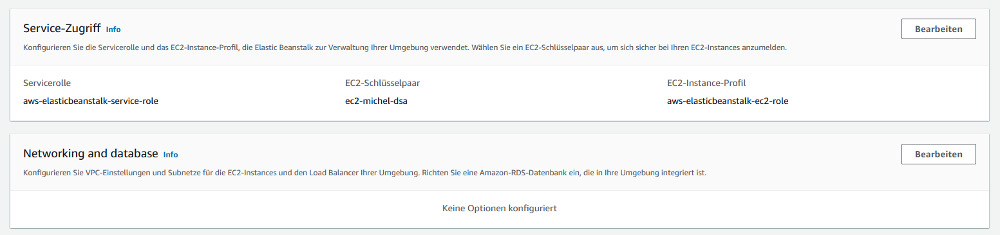
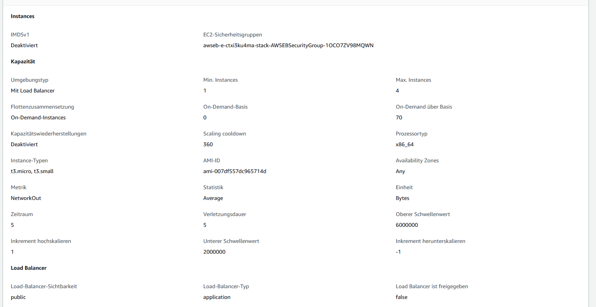
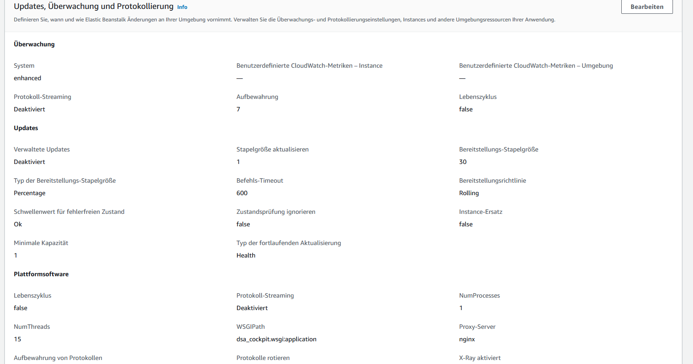

# Installation

This application runs with python 3.6. Anything newer fails. Upgrade is planned, but not there yet


# Running the app for development

# Switching to the virtual environment

`source dsavenv/bin/activate`

Since it is a django app, call

`python manage.py runserver`

making the app available over the network

`python manage.py runserver 0.0.0.0:8000`

## Deployment

````shell

eb create -d -r eu-central-1 --single

````





# to dos


## Cloud-readiness

- [ ] Websockets on elastic beanstalk
  - [x] Install Requirements daphne and so forth
  - [x] Set up Application Loadbalancer
  - [x] Create Procfile
  - [x] set up Listener, Rules and Processes in Configuration 
- [ ] Find the newest sqlite-db-version
- [x] Make the frontend play nice when delivered by the django app
  - [x] Consider different ports
  - [x] How does routing work in here?
    - [x] Set up separate directory for app? 
    - [x] Or use S3 for this?
      - [x] If we use S3, how do we make sure that this works in development as well as in production?... we do not serve via S3 in development anyway ...
- [ ] Login für REST
- [ ] Login für WebSocket-Kommunikation
- [ ] Login für Angular-App anbinden

- vielleicht doch das mit dem serializable irgendwie weg machen ... das ist doch nur Aufwand eigentlich

- [ ] NPCs aufbauen
  - [x] CharacterModels müssen NPCs unterstützen
  - [x] NPC Abenteuer hinzufügen
  - [ ] Basiswerte?


- [ ] NPC-Generator
  - [ ] Templates?
  - [ ] Namen einbauen?
  - [ ] 

- [x] "Rasse": Tulamidin, Thorwaller etc.
- [ ] Sprachen
- [ ] Alter
- [ ] modifikatoren (rasse, sonderfertigkeiten etc.)
- [ ] sonderfertigkeiten
- [ ] gute und schlechte Eigenschaften
- [ ] rüstung-model

done
- [x] money
- [x] key values for WeaponSkillDistribution
- [x] waffen-model
- [x] magic