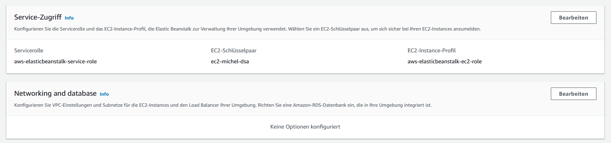
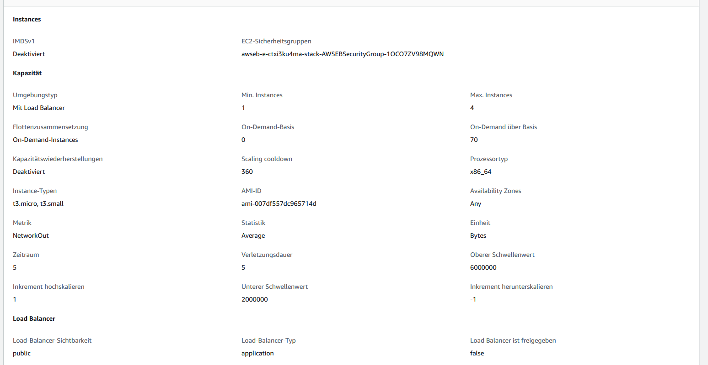
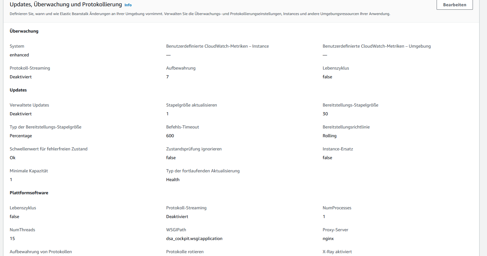

# Installation

This application runs with python 3.6. Anything newer fails. Upgrade is planned, but not there yet


# Running the app for development

# Switching to the virtual environment

`source dsavenv/bin/activate`

Since it is a django app, call

`python manage.py runserver`

making the app available over the network

`python manage.py runserver 0.0.0.0:8000`

## Deployment

````shell

eb create -d -r eu-central-1 --single

````





# to dos

- vielleicht doch das mit dem serializable irgendwie weg machen ... das ist doch nur Aufwand eigentlich

## Abenteuerverwaltung

Aktuell ist es auf der Datenbank möglich, ein Abenteuer als "aktiv" zu setzen. Folgende Entitäten haben einen Abenteuerbezug:

- Bilder
- Locations
- NPCs

Über das Django-Frontend kann man aktuell Abenteuer anlegen etc.

  - [ ]  

- [ ] NPCs aufbauen
  - [x] CharacterModels müssen NPCs unterstützen
  - [x] NPC Abenteuer hinzufügen
  - [ ] Basiswerte?


- [ ] NPC-Generator
  - [ ] Templates?
  - [ ] Namen einbauen?
  - [ ] 

- [x] "Rasse": Tulamidin, Thorwaller etc.
- [ ] Sprachen
- [ ] Alter
- [ ] modifikatoren (rasse, sonderfertigkeiten etc.)
- [ ] sonderfertigkeiten
- [ ] gute und schlechte Eigenschaften
- [ ] rüstung-model

done
- [x] money
- [x] key values for WeaponSkillDistribution
- [x] waffen-model
- [x] magic

